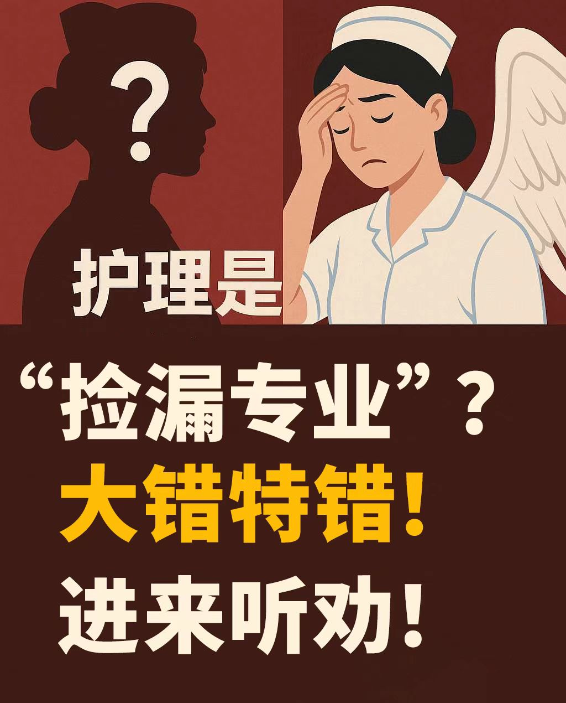

Hello，各位同学和家长们！在高考志愿填报的众多选择中，护理学专业常常引发讨论。你是否也曾听过这样的说法：“学护理？那是‘捡漏’的选择吧，分数不用太高就可以上名校，毕业也好找工作。” 甚至有人认为，护理就是简单的“打针发药”、“伺候人”。

但，真相果真如此吗？“捡漏”一词，是否严重低估了这个专业？ 今天，我们就来深入探讨一下，真实的护理学究竟是怎样的。

## 一、 破除“捡漏”迷思：护理学的高门槛与高要求

首先，必须明确一点：将护理学简单视为“捡漏专业”是一种极大的误解，甚至可以说是偏见。

知识体系复杂，绝非“没技术含量”:

- 护理学需要学习扎实的医学基础知识，包括但不限于：解剖学、生理学、病理学、药理学、生物化学等，其难度和广度不容小觑。

- 更要掌握系统的护理专业知识和技能：基础护理学、内科护理学、外科护理学、妇产科护理学、儿科护理学、急危重症护理学、护理心理学、护理伦理学等等。

- 现代护理远不止于执行医嘱，更强调评估、判断、沟通、健康教育、心理支持等多方面的综合能力。护士是医疗团队中不可或缺的、拥有专业判断力的成员。

入学门槛并非想象中那么低:

- 虽然相较于临床医学等顶尖热门专业，部分院校护理学的录取分数可能相对低一些，但这绝不意味着“随便进”。

- 知名医学院校的护理专业，录取分数线依然很高，竞争激烈。

- 护理专业对学生的综合素质要求很高，包括细心、耐心、责任心、沟通能力、抗压能力以及一定的体力要求。

## 二、 真实的护理工作：挑战与价值并存

选择了护理，意味着选择了一条充满挑战但也极具价值的道路。

挑战：

- 高强度工作: 临床一线护士常常需要倒班（包括夜班），工作节奏快，体力消耗大。

- 高压力环境: 面对患者的病痛、家属的焦虑，甚至偶尔的误解和冲突，需要强大的心理承受能力。

- 高风险职业: 存在职业暴露（如感染）和潜在的医疗风险。

- 持续学习: 医学知识和技术不断更新，需要终身学习。

价值与回报：

- 职业成就感: 亲手帮助患者减轻痛苦、恢复健康，这种成就感是许多其他工作难以比拟的。

- 社会尊重度提升: 尤其经历重大公共卫生事件后，社会对护士的专业价值和奉献精神有了更深的认识。

- 稳定的就业: 医疗行业是刚需，专业的护理人才缺口长期存在，就业相对稳定。

- 多元化的职业发展: 不仅仅局限于医院病房，还可以向专科护士（如ICU、手术室、伤口造口、糖尿病护理等）、护理管理（护士长、护理部主任）、护理教育、社区护理、健康管理、甚至医药器械公司等方向发展。出国深造和工作的机会也相对较多。

## 三、 什么样的人适合学护理？

护理学并非适合所有人。如果你具备以下特质，可能会更适应这个专业：

- 有爱心和同情心： 能真切地关怀他人。

- 有责任心和细心： 对患者的生命健康负责，操作严谨。

- 良好的沟通能力： 能与患者、家属、医生有效沟通。

- 较强的抗压能力： 能应对高强度、高压力的工作环境。

- 健康的身体素质： 能适应倒班和体力要求。

- 终身学习的意愿： 愿意不断更新知识和技能。

## 四、 总结：不是“捡漏”，而是慎重的选择

将护理学视为“捡漏”，是对这个专业极大的不尊重和误解。它需要系统的学习、严格的训练、高度的责任感和持续的付出。

选择护理，不应该是“没得选”的无奈之举，而应是基于对专业真实情况的了解，结合自身兴趣、能力和价值观做出的慎重决定。它或许充满挑战，但同样能带来非凡的职业价值和人生体验。

希望今天的分享，能帮助你更全面、更客观地认识护理学。选择专业是大事，愿你能拨开迷雾，找到真正适合自己的方向！

你对护理专业还有哪些疑问？或者你身边有学护理的同学/朋友吗？欢迎在评论区分享你的看法！
