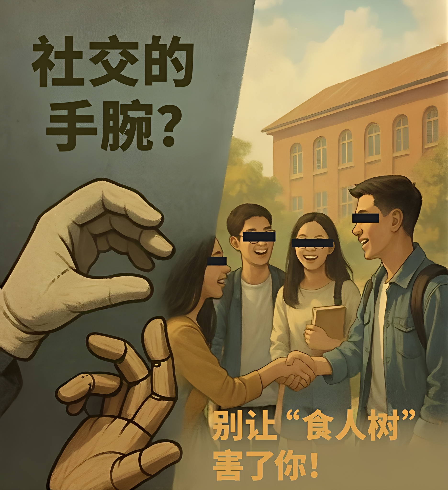

亲爱的同学们，  
当你点开这篇文章时，也许你的社交媒体推送信息流里正充斥着各种“一招教你识破人心”、“三句话拿捏社交场合”的短视频。它们往往配着意味深长的BGM，打上 #食人树 #社交的手腕 #暗黑心理学 等标签，仿佛掌握了这些，就能在大学这个小型社会里左右逢源，无往不利。  
打住！暂停一下你那准备点赞收藏的手。咱们今天就来聊聊，这些所谓的“生存秘籍”，到底是助你成长的“智慧锦囊”，还是可能让你误入歧途的“食人树”？

## 大学不是“宫斗剧”，人心不是“公式题”

大学，是知识的殿堂，更是人格塑造、心智成熟的关键期。人与人的交往，本应建立在尊重、理解和真诚的基础上。而网络上泛滥的“识人术”，常常将复杂的人性简单化、标签化，教你通过几个微表情、几句口头禅就给人“定性”。这不仅是对他人的不尊重，更容易让你戴上有色眼镜，错失真正了解一个人的机会，甚至变得多疑、刻薄。
至于那些“社交手腕”，有些听起来头头是道，实则可能是精致的利己主义包装。它们鼓励的不是建立健康的连接，而是追求短期的“效果”和“掌控”。长期沉溺于此，你可能会发现自己越来越“会社交”，却越来越孤独。因为技巧代替不了真诚，表演也换不来真心。

## 警惕“生存法则”下的“过度武装”

沉迷于这些“读心术”和“社交手腕”，还有一个隐蔽的风险——它会让你不自觉地进入一种“过度武装”的状态。你开始习惯性地揣测他人的动机，分析每句话背后的“潜台词”，甚至在没有必要的时候也竖起防备的“盾牌”。这就像给自己的心穿上厚厚的盔甲，看似安全了，却隔绝了阳光和空气。真实的、温暖的连接，往往发生在卸下防备、坦诚相待的瞬间。当你把精力过多地投入到“防御”和“算计”中时，不仅会感到心累，更可能错失大学里那些本可以滋养你心灵的真挚友谊、思想碰撞的火花，以及在试错中学习、在包容中成长的宝贵机会。真正的成熟不是“刀枪不入”，而是拥有开放的心态和处理复杂情感的韧性。

## 今天“拿捏”，明天可能“翻车”

说实话，看着那些视频一本正经地传授“看眼神辨忠奸”、“从坐姿知深浅”的“绝学”，是不是有种哭笑不得的感觉？仿佛大学校园是武林大会，人人揣着秘籍，眼神一对就是一场“高手过招”。
拜托，现实哪有那么多戏？你同学可能只是昨天没睡好眼神涣散，或者只是单纯喜欢那个舒服的坐姿。用几条所谓的“定律”去框定活生生的人，本身就是最大的“不靠谱”。今天靠“手腕”暂时“拿捏”了局面，明天遇到不按套路出牌的，分分钟可能“大型翻车现场”。与其研究这些“屠龙术”，不如想想论文怎么写，社团活动怎么搞，或者，下顿吃什么？（这可能更实在）

## 拆掉“心墙”，而非筑起“堡垒”

想一想，大学里许多宝贵的经历，都离不开人与人之间的协作与信任。无论是小组作业的头脑风暴，社团活动的并肩作战，还是宿舍卧谈的深夜分享，这些都需要我们敞开心扉，真诚沟通，甚至适度地展现脆弱和寻求帮助。而那些所谓的“社交手腕”，本质上是在教你如何“隐藏”和“伪装”，如何在互动中不动声色地为自己谋利。当你习惯性地运用这些“技巧”时，你可能在不经意间，已经在自己和他人之间筑起了一道无形的“心墙”。这堵墙看似保护了你，让你显得“高深莫测”，但也阻断了建立深度连接的可能性。真正的合作需要互信作为基石，而猜忌和算计只会腐蚀它。长此以往，你可能会发现，自己越来越难以融入需要紧密协作的团队，也越来越难体会到齐心协力达成目标的成就感与喜悦。比起费尽心机去“掌控”局面，学会在合作中贡献价值、在沟通中寻求共识，才是大学教给我们的更重要的能力。

给大学生的真心话：  
真正的社交能力，是在一次次真实的互动中，在理解与被理解中，在冲突与和解中慢慢培养的。它关乎同理心、沟通力、边界感，还有最重要的：真诚。
大学四年，宝贵而短暂。别让有毒的“食人树”和看似高明的“社交手腕”，占据了你本该用来真诚体验、学习成长的空间。毕竟，生活不是一场处心积虑的“闯关游戏”，而是一段用心感受的旅程。  
祝大家都能在大学里，收获知识，也收获真挚的情谊。
