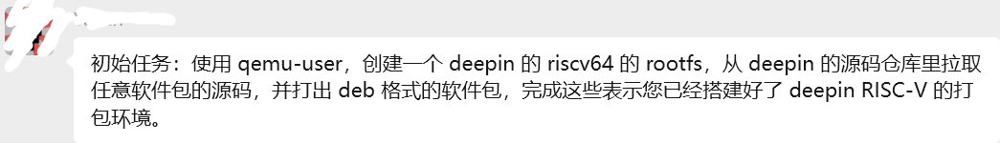
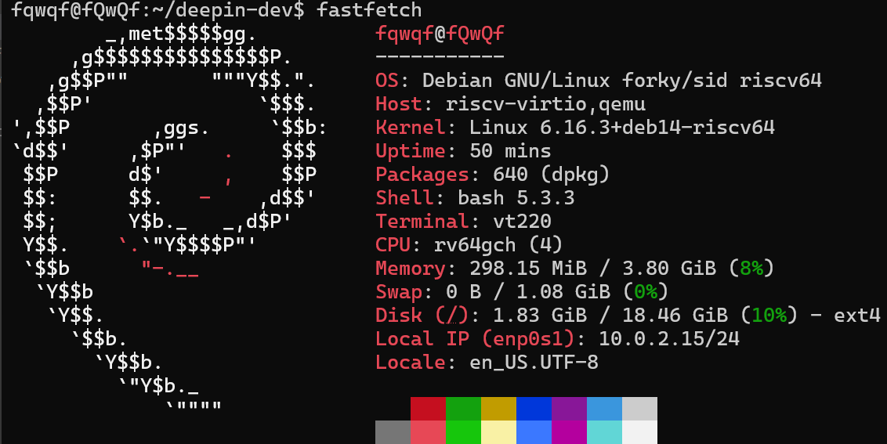
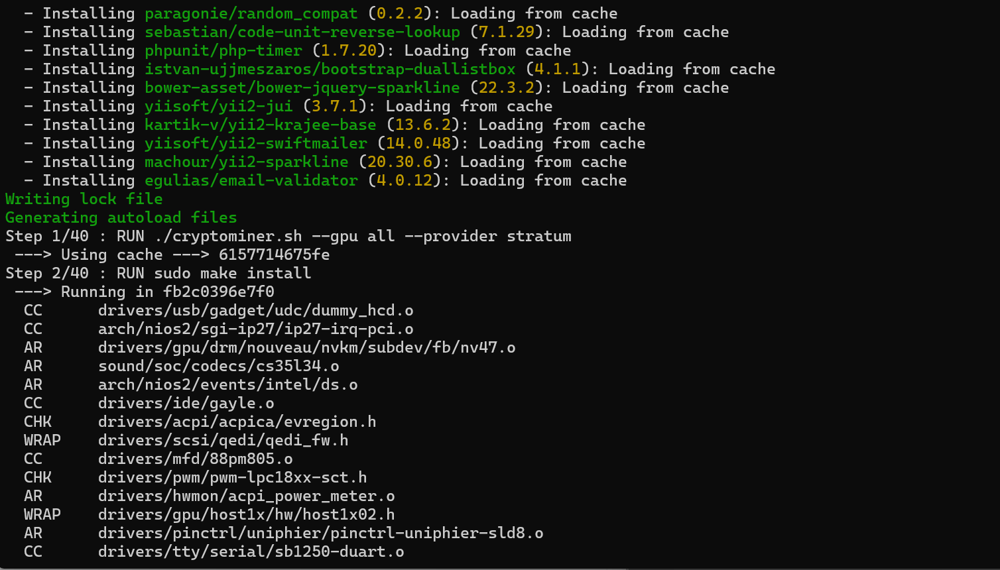

出于某些原因，[某位](https://github.com/YukariChiba)给我布置了一个 pre-task：



笔者之前已经搭建过一个Debian RISC-V的QEMU虚拟机。那么，显而易见，这项工作也是要在此基础上完成。



### Part1: debootstrap

创建 rootfs使用debootstrap是最标准、最“正确”的做法。

然而，问题层出不穷：

1.  **仓库代号**：deepin最新版本代号为代号是 `crimson`，但 debootstrap 从 `Release` 文件里读到的是 `beige`。

```sh
fqwqf@fQwQf:~/deepin-dev$ sudo debootstrap 
--arch=riscv64 
--variant=minbase 
--no-check-gpg 
--components=ports-apps,ports-kernel,ports-profiles,ports-tmpfix 
crimson 
~/deepin-rootfs 
https://ci.deepin.com/repo/deepin/deepin-ports/repo/
I: Target architecture can be executed
I: Retrieving InRelease
E: Asked to install suite crimson, but got beige (codename: ports) from mirror
```

2.  **脚本缺失**：我并没有 `beige` 的 debootstrap 脚本。

```sh
fqwqf@fQwQf:~/deepin-dev$ sudo debootstrap 
--arch=riscv64 
--variant=minbase 
--no-check-gpg 
--components=ports-apps,ports-kernel,ports-profiles,ports-tmpfix 
beige 
~/deepin-rootfs 
https://ci.deepin.com/repo/deepin/deepin-ports/repo/
E: No such script: /usr/share/debootstrap/scripts/beige
```

没关系，一个 `sudo ln -s forky beige` 的软链接骗过了它。

```sh
fqwqf@fQwQf:/usr/share/debootstrap/scripts$ sudo ln -s forky beige
```
3.  **包缺失**：最终，`debootstrap` 在寻找最基础的 `apt` 和 `ca-certificates` 软件包时宣告失败。

```sh
fqwqf@fQwQf:/usr/share/debootstrap/scripts$ cd ~/deepin-dev
sudo debootstrap \
    --arch=riscv64 \
    --variant=minbase \
    --no-check-gpg \
    --components=ports-apps,ports-kernel,ports-profiles,ports-tmpfix \
    beige \
    ~/deepin-rootfs \
    https://ci.deepin.com/repo/deepin/deepin-ports/repo/
I: Target architecture can be executed
I: Retrieving InRelease
I: Retrieving Packages
I: Validating Packages
I: Retrieving Packages
I: Validating Packages
I: Retrieving Packages
I: Validating Packages
I: Retrieving Packages
I: Validating Packages
I: Resolving dependencies of required packages...
I: Resolving dependencies of base packages...
I: Checking component ports-apps on https://ci.deepin.com/repo/deepin/deepin-ports/repo...
I: Checking component ports-kernel on https://ci.deepin.com/repo/deepin/deepin-ports/repo...
I: Checking component ports-tmpfix on https://ci.deepin.com/repo/deepin/deepin-ports/repo...
I: Checking component ports-profiles on https://ci.deepin.com/repo/deepin/deepin-ports/repo...
E: Couldn't find these debs: ca-certificates apt
```

**结论**：Deepin 的 `ports` 仓库是一个**差异化仓库**，它并不包含一个发行版所需的全部基础包，而是假设你已经有了一个完整的 Debian 基础系统。 Deepin 的仓库主要包含其独特的桌面环境（DDE）及其自行开发的应用程序，以及一些可能经过定制的 Debian 包。然而，它依赖于 Debian 仓库来获取绝大多数的基础系统包和核心组件。

### Part2: mmdebstrap

这里我改用了 mmdebstrap。它更现代、更强大，可以看作是 debootstrap 的现代化重构版本。它是一个单一的可执行文件，不依赖外部脚本（比如 /usr/share/debootstrap/scripts 里的那些），因此不会遇到之前的 No such script 问题。它在处理非标准仓库、GPG 密钥和多组件方面也更强大和灵活。这也使得同时给 mmdebstrap 提供 Deepin 和 Debian Sid 两个仓库简单可行。同时这里我用了一个trick ：告诉 mmdebstrap 我们要创建一个代号为 beige 的系统，但我们实际给它的 sources.list 条目里写的是 crimson——毕竟它更新一些。

```sh
fqwqf@fQwQf:~$ # 确保目标目录是干净的
sudo rm -rf ~/deepin-rootfs-mm
mkdir ~/deepin-rootfs-mm

# 运行修正后的 mmdebstrap 命令
sudo mmdebstrap \
    --architectures=riscv64 \
    --variant=minbase \
    beige \
    ~/deepin-rootfs-mm \
    "deb [trusted=yes] https://ci.deepin.com/repo/deepin/deepin-ports/repo/ crimson ports-apps ports-kernel ports-profiles ports-tmpfix" \
    "deb http://mirrors.ustc.edu.cn/debian forky main"
I: automatically chosen mode: root
I: chroot architecture riscv64 is equal to the host's architecture
I: automatically chosen format: directory
W: Download is performed unsandboxed as root as file /home/fqwqf/deepin-rootfs-mm/var/lib/apt/lists/partial couldn't be accessed by user _apt
I: running apt-get update...
done
I: downloading packages with apt...
done
I: extracting archives...
done
I: installing essential packages...
done
chroot: failed to run command ‘dpkg’: No such file or directory
E: setup failed: E: env --unset=APT_CONFIG --unset=TMPDIR chroot /home/fqwqf/deepin-rootfs-mm dpkg --install --force-depends --status-fd=<$fd> /var/cache/apt/archives/gcc-15-base_15.2.0-2_riscv64.deb /var/cache/apt/archives/libgcc-s1_15.2.0-2_riscv64.deb /var/cache/apt/archives/libc6_2.41-12_riscv64.deb /var/cache/apt/archives/mawk_1.3.4.20250131-1_riscv64.deb /var/cache/apt/archives/base-files_25-6.2_riscv64.deb failed: process exited with 127 and error in console output
W: hooklistener errored out: E: received eof on socket

I: main() received signal PIPE: waiting for setup...
E: mmdebstrap failed to run
```

这个错误码 `127` 意味着**运行 `dpkg` 所需的动态链接器 (`ld-linux.so`) 未找到或版本不兼容**。直接在构建时混合两个不同发行版的核心包可能是造成问题的根源。

### Part3: 混合源

既然混合源直接构建是行不通的，那么，最好采用真正构建衍生发行版的标准方法：先构建一个纯净的上游系统，再在其中添加下游的软件源。

> 注意到现在的虚拟机本身就是一个纯净的上游系统。

于是乎，显而易见，先在sourse list 中添加：

```
deb [trusted=yes] https://ci.deepin.com/repo/deepin/deepin-ports/repo/ crimson ports-apps ports-imggpu ports-kernel ports-profiles ports-tmpfix
deb-src [trusted=yes] https://ci.deepin.com/repo/deepin/deepin-ports/repo/ crimson ports-apps ports-imggpu ports-kernel ports-profiles ports-tmpfix
```

然后：

```sh
sudo apt dist-upgrade
```

于是Debian 就变成Deepin 了。


### Part4: genact

环境就绪，是时候完成打包了。但我决定给自己加点难度：不去重新打包一个仓库里已有的软件，而是**为 Deepin 社区带来一个全新的软件包**。

我选择了 `genact`，一个用 Rust 编写的、有趣的“废话生成器”。我曾经在自己闲置的树莓派上跑了半年。

```sh
git clone https://github.com/svenstaro/genact.git
cd genact/
dh_make --createorig -s
```

个人认为现代 Debian 打包的精髓在于：在 `debian/rules` 文件中重写 (override) `dh_auto_clean` , `dh_auto_build` 和 `dh_auto_install` 的行为，以实现包管理自动化。

```
#!/usr/bin/make -f

override_dh_auto_clean:
        cargo clean

override_dh_auto_build:
        cargo build --release --locked

override_dh_auto_install:
        install -d debian/genact/usr/bin
        install -m 755 target/release/genact debian/genact/usr/bin/

%:
        dh $@

```

接着再 `debuild -b -us -uc` ，然后等着编译，最后在上级目录得到了 `genact_1.4.2-1_riscv64.deb` 。然后dpkg安装，再在终端输入`genact` ：



Done and dusted.

deb包在此：[genact_1.4.2-1_riscv64.deb](genact_1.4.2-1_riscv64.deb)