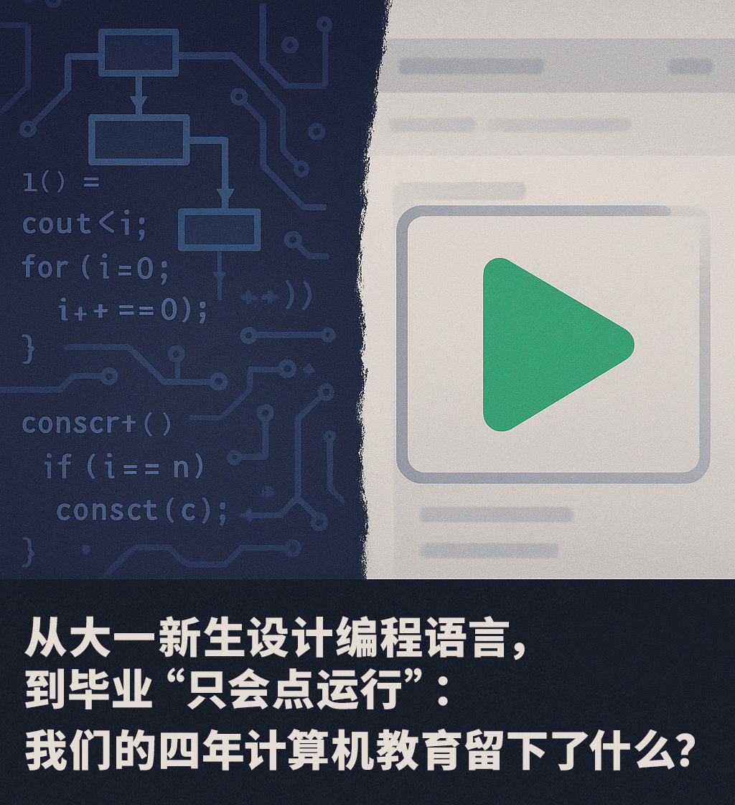
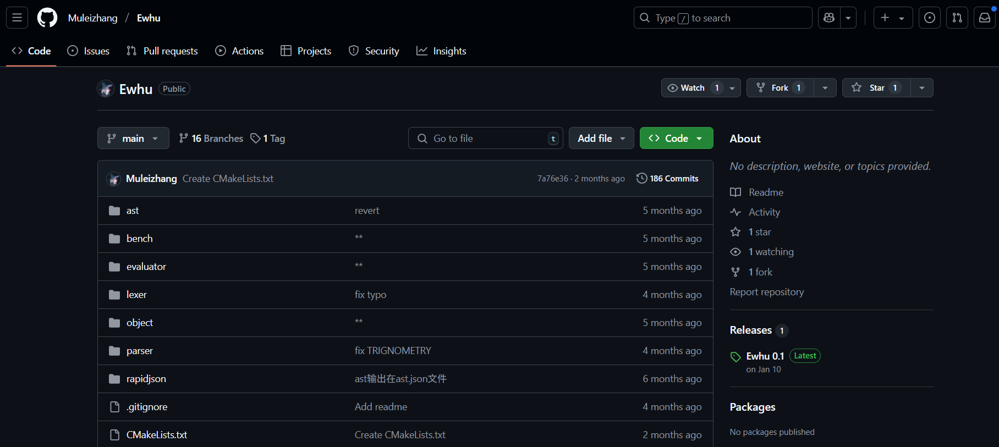
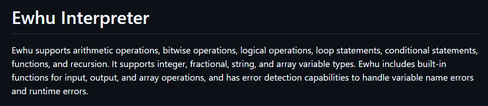
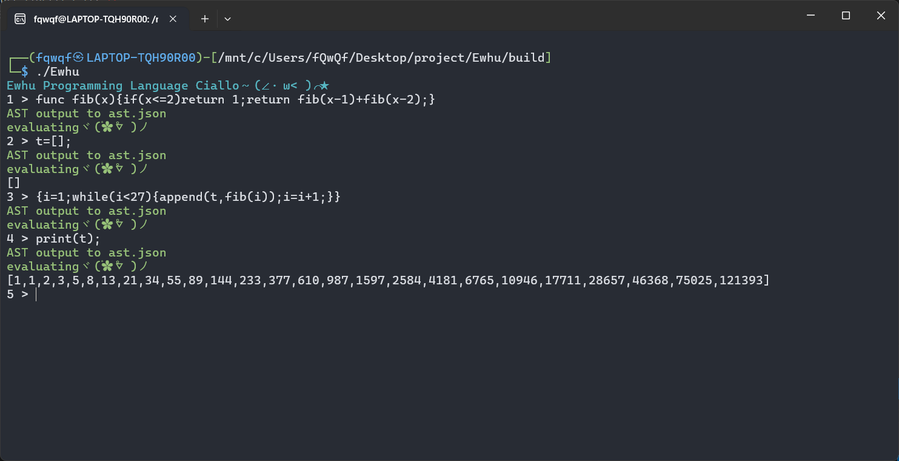
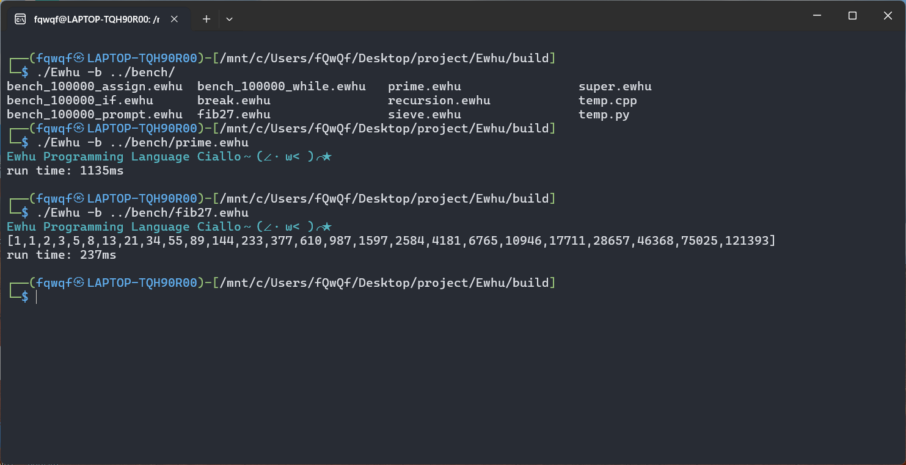

让我们从一个 GitHub 仓库开始。屏幕截图展示的，是一个名叫 Ewhu 的编程语言解释器。它的作者，是几位大一的学生，这是他们“高级语言程序设计”这门课的大作业。

  
别小看这个“大一作品”。按照作者的介绍，Ewhu 已经颇具雏形：它能处理算术、位运算、逻辑判断，支持循环和条件语句，甚至实现了函数定义和递归。变量类型覆盖了整型、浮点型（或分数）、字符串和数组。输入输出、数组操作这些基础功能也内建了，还带点错误检测，能捕捉变量名错误和一些运行时的问题。它既可以像个计算器一样交互式运行，也能规规矩矩地执行你写在文件里的代码。

  
（翻译：Ewhu支持算术运算、位运算、逻辑运算、循环语句、条件语句、函数及递归功能。该语言支持整数、分数、字符串和数组变量类型，内置输入输出函数与数组操作方法，并具备错误检测机制，能够识别变量命名错误和运行时异常。）

看到这里，你是什么感觉？惊叹？佩服？或许还有一丝……恍惚？

几名仅仅接触大学计算机教育几个月的学生，就已经在尝试触碰编译器、解释器这个计算机科学领域相对核心和底层的部分了。这无疑是非常了不起的成就，闪耀着天赋和努力的光芒。但紧随其后的，是一个更沉重、也更普遍的问题，它盘旋在许多计算机专业学生、毕业生，乃至教育工作者的心头：

相比之下，我们用了四年时间，经历了《数据结构》、《算法导论》、《操作系统》、《编译原理》、《计算机网络》等一系列“硬核”课程的洗礼，最终交出的毕业设计（或者说，毕业时达到的能力水准），又常常是什么样的呢？

并非想要一概而论，每年都有许多优秀的毕业设计涌现。但扪心自问，或者环顾四周，我们看到更多的是不是这些景象：各式各样的管理信息系统（MIS），从图书馆到学生信息，从仓库到在线商城，它们大多基于成熟的 Web 框架和数据库技术，核心在于业务逻辑的梳理和数据的增删改查；或者是小型的 App、小程序、个人网站；又或者是调用现成库实现的简单人脸识别、数据可视化项目……

这些项目当然有其价值。它们训练了我们使用流行工具、框架的能力，熟悉了软件开发的基本流程，让我们能更快地对接到某些业界的需求。完成它们，也绝非易事，需要投入大量时间和精力。

然而，当我们把这些项目放在 Ewhu 旁边时，一种微妙的落差感油然而生。 Ewhu 这个项目，哪怕它还很简单、很稚嫩，但它尝试去构建一个执行代码的基础设施。它要求作者去思考词法分析、语法解析、抽象语法树、作用域、执行上下文这些语言底层的问题。这是一种从相对“第一性原理”出发的探索。

而许多毕业设计，尽管功能看起来更“完整”、界面更“漂亮”，但它们更多地是在使用高度封装好的工具和框架。我们可能熟练地配置 Spring Boot，调用各种库函数，但对于 Spring Boot 的 Bean 如何加载、依赖注入如何实现，对于数据库索引为何选用 B+ 树，对于网络请求在 TCP/IP 协议栈中如何流转，我们是否真正理解了？那些曾经在课堂上让我们痛苦不堪的《编译原理》、《操作系统》知识，在最终的毕业设计里，似乎常常沦为“学过但用不上”的屠龙之技。点击 IDE 那个绿色的“运行”按钮，它背后发生的编译、链接、加载、执行过程，对我们来说，是不是依然像个“黑箱”？

可以说，那些大一新生通过 Ewhu 项目所展现出的对计算机科学核心原理的探究深度和动手能力，在某种意义上，甚至超越了不少按部就班完成的、更偏向应用层开发的毕业设计。 这不是在否定应用层开发的重要性，而是想探讨：我们的四年教育，是否本应引导更多学生，在完成学业时，能够具备这种向下探索、理解底层、甚至动手“造轮子”的勇气和能力？

这种差距的背后，或许折射出我们计算机教育体系中一些值得深思的地方。

我们常常感叹理论与实践的脱节。核心基础课学得艰深，但实验课却可能是按图索骥，缺乏挑战性和综合性。等到真正需要动手做项目时，又发现理论知识悬在空中，无法落地。于是，我们倾向于选择那些有成熟方案、容易快速看到成果的方向，比如使用现成的 Web 框架搭个网站。这似乎成了一条“阻力最小”的路径。

同时，“实用主义”的风潮也影响着教学。为了让学生毕业后能“快速上手”，教学内容可能过多地集中在流行的框架和工具上。这本身没错，但如果因此挤压了对底层原理深入讲解和实践的时间，就可能导致基础不牢。我们学会了如何“开车”，却不太懂发动机和变速箱是如何工作的。当车子稍微出点怪毛病，或者想改装一下时，就束手无策了。

课程体系的更新和整合也是个老问题。计算机技术日新月异，但培养方案的修订往往需要时间。各门课程之间也可能缺乏有机的串联，学的时候是“一座座孤岛”，难以形成知识体系去解决复杂问题。那个写解释器的同学，显然是把“程序设计”、“数据结构”甚至可能自学的“编译原理”初步知识给串起来了。

更深层次的，是创新氛围和评价体系。我们的教育环境，是否足够鼓励学生去“折腾”那些看起来不那么“实用”、短期内看不到明确“产出”但对理解底层至关重要的东西？当评价体系更侧重于项目的功能完整性、报告的规范性时，那些愿意花大量时间啃硬骨头、挑战难题的学生，他们的努力是否能得到相应的认可？

当然，我们并非全然悲观。

值得欣慰的是，改变正在发生。越来越多的老师开始尝试项目驱动式教学（PBL），将硬核的理论知识融入更有趣、更连贯的实践项目中。一些高校开始开设更具挑战性的课程，比如要求学生自己动手写操作系统内核模块、实现简易的编译器或网络协议栈。开源文化在国内高校中也日益普及，很多学生通过参与真实的开源项目，获得了远超课堂所学的锻炼。像 GitHub 这样的平台，也让 Ewhu 这样的优秀作品得以被看见，激励着更多人。每年各类计算机竞赛（如 ACM-ICPC、操作系统大赛等）中，也涌现出大量基础扎实、能力出众的学生。

这些都是积极的信号。它们表明，提升计算机教育质量、培养真正具备深厚内功和创新能力的人才，已经成为越来越多教育者和学生的共识与追求。

展望未来，我们期待的中国大学计算机教育，应该是一种能更好平衡“广度”与“深度”、“应用”与“基础”、“使用工具”与“理解原理”的教育。 它不仅要教会学生使用最新的技术栈，更要让他们理解这些技术背后的计算机科学原理；它不仅要培养能快速开发应用的工程师，更要孕育能解决核心问题、推动技术进步的计算机科学家和系统设计者。

我期待着，未来的中国大学计算机教育，能够系统性地培养出这样的人才：他们不仅能熟练地使用现有的工具和框架解决问题，更能深刻理解这些工具背后的原理和设计哲学；他们不仅能快速跟上技术的潮流，更能洞察技术发展的脉络，甚至具备引领变革的潜力；他们面对复杂的系统性难题时，不会止步于“调包”、“搜报错”，而是能够运用扎实的理论基础和工程思维去分析、诊断、乃至重构。

这不仅仅是为了培养少数几个能“造语言”、“写内核”的天才，更是为了全面提升整个计算机专业毕业生的技术底蕴和创新势能。当更多的学生具备了向下探索的能力和勇气，当“理解原理”和“动手实践”成为一种普遍的追求和习惯时，我们才能真正从“跟跑者”向“领跑者”转变，才能在核心技术领域拥有更强的话语权和自主性。

这需要教育者拿出更大的魄力去改革课程体系与评价标准，需要行业提供更开放的心态和更具深度的合作，也需要我们每一个身处其中的学生，保持那份对技术本源的好奇心和探索欲，不满足于仅仅停留在应用的表层。

这条路无疑是漫长且充满挑战的。但正如 Ewhu 的作者在大一就已经开始了他们的探索一样，改变，永远不嫌太早。每一点课程设计的优化，每一次对底层知识的深入探讨，每一个鼓励创新的尝试，都在为构建一个更强大、更具活力的中国计算机科学未来添砖加瓦。

从熟练点击“运行”按钮，到真正理解并有能力去打造我们自己的“创造引擎”，这中间的距离，需要我们共同去丈量和缩短。或许正如计算机先驱艾伦·凯（Alan Kay）所言：

“预测未来的最好方法，就是去创造未来。”  
(The best way to predict the future is to invent it.)

共勉。
