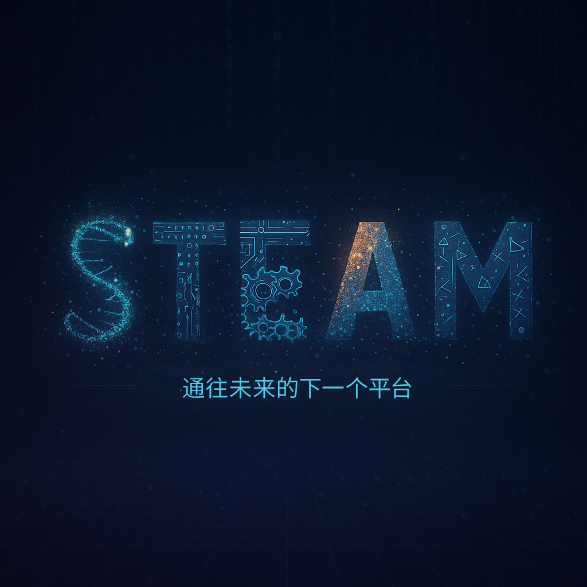
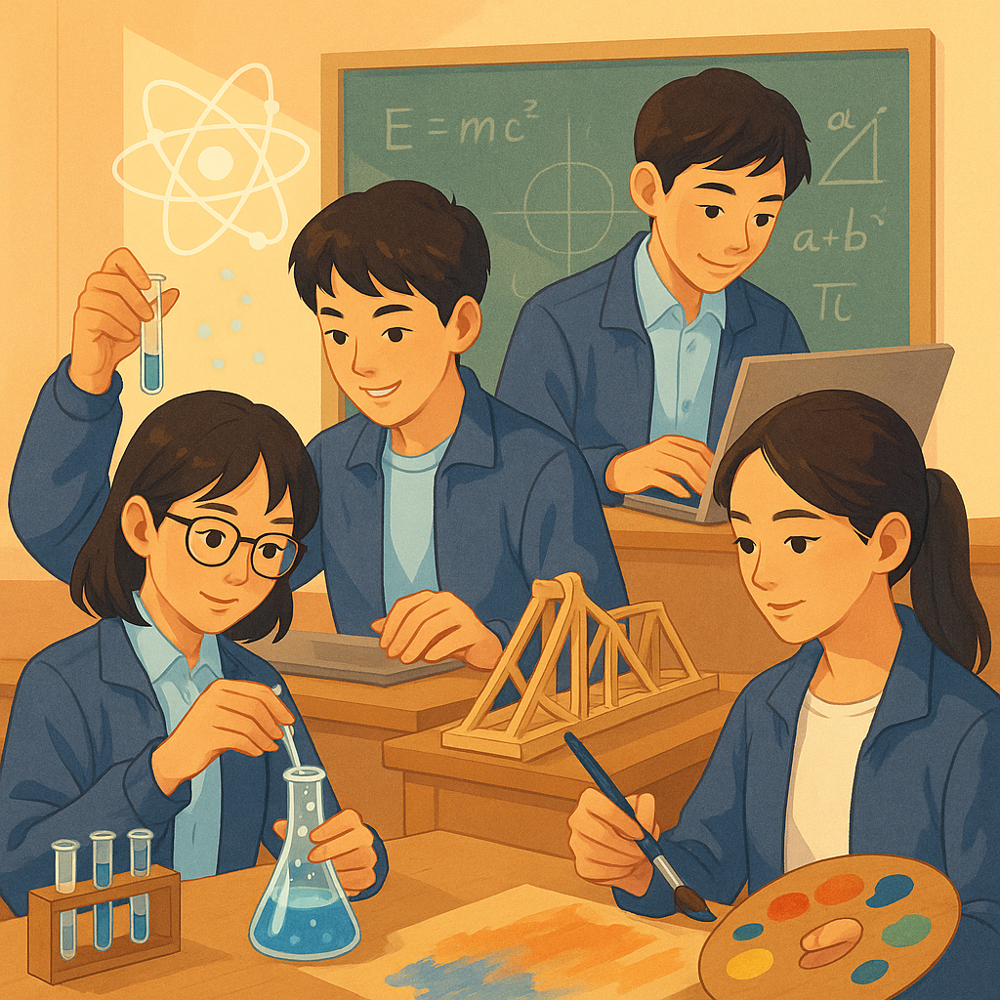

笔者知道你在想什么。当“STEAM”这个词出现在你的公众号推送中，你是否也曾一瞬间联想到了某个让你沉浸其中的游戏平台？先别急着打开你的游戏库！今天，我们要聊的STEAM，虽然不直接提供数字娱乐，但它所蕴含的能量，却足以让你在未来的“人生游戏”中，解锁更多意想不到的“成就”与“超能力”！

## STEAM，究竟是什么“神装”？

简单来说，STEAM是五个英文单词的首字母缩写：

S - Science (科学)：探索世界的奥秘，理解自然法则，培养严谨的探究精神和实验能力。从物理现象到化学反应，从生命科学到宇宙星辰，科学是认知世界的基础。

T - Technology (技术)：运用科学知识解决实际问题，创造新的工具和方法。编程、人工智能、3D打印、信息技术……技术正在以前所未有的速度改变世界。

E - Engineering (工程)：将科学与数学原理应用于设计和建造。小到一座桥梁模型，大到复杂的系统工程，工程思维强调的是解决问题的能力和创新设计。

A - Arts (艺术)：培养审美情趣、创意思维和表达能力。绘画、音乐、设计、戏剧……艺术不仅是美的享受，更是激发创新灵感、提升人文素养的重要途径。它让冰冷的科技拥有温度，让严谨的工程闪耀人文光辉。

M - Mathematics (数学)：逻辑推理、模式识别、数据分析的基础。数学是科学的语言，是工程的基石，也是技术发展的强大引擎。

STEAM教育并非简单地将这五门学科进行叠加，而是强调跨学科的融合与应用。它鼓励我们像科学家一样思考，像工程师一样解决问题，像艺术家一样创造，并用技术和数学作为强大的工具。

## 高中生，为什么需要“装备”STEAM思维？

进入高中，学生面临的不仅仅是学科知识的深化，更是未来方向选择的关键时期。STEAM教育能提供的，正是适应未来社会的核心竞争力：

提升问题解决能力： STEAM项目常常围绕一个真实世界的问题展开，你需要调动不同学科的知识，像玩一个复杂的“解谜游戏”一样，分析问题、设计方案、动手实践、测试迭代，最终找到解决方案。

激发创新思维： 当科学的严谨遇上艺术的浪漫，当技术的实现结合工程的巧思，创新的火花便更容易被点燃。STEAM鼓励你打破思维定势，从不同角度思考，提出独特的见解和方案。

培养协作与沟通能力： 很多STEAM项目需要团队合作完成，这要求你学会倾听、表达、协商，与不同背景的同伴一起“组队打怪”，共同达成目标。

增强实践动手能力： “纸上得来终觉浅，绝知此事要躬行。” STEAM强调从“做”中学，让你在亲手操作、亲身体验中深化理解，将理论知识转化为实实在在的技能。

助力未来学业与职业规划： 无论是选择理工科、设计类还是新兴交叉学科，STEAM素养都将为你打下坚实基础。许多大学在招生时也越来越看重学生的综合实践能力和创新潜质。未来社会对复合型人才的需求日益增加，具备STEAM素养的人无疑拥有更广阔的“游戏地图”。

## 如何“开启”你的STEAM之旅？

其实，STEAM并非遥不可及，它可以融入到你的日常学习和生活中：

保持好奇心： 对身边的事物多问几个“为什么”。

积极参与： 参加学校的科技节、艺术展、数学建模、编程社团等活动。

动手实践： 尝试修理家里的旧电器，用废旧材料做个小发明，或者学习一项新的乐器。

跨界学习： 读一本天文学的书，了解一下建筑设计的历史，或者看看艺术如何与科技结合。

拥抱挑战： 不要害怕失败，每一次尝试都是一次“经验值”的积累。

---

STEAM就像一个充满无限可能的“沙盒世界”，等待着你去探索、去创造、去定义。它或许不能直接给你带来游戏的快感，但它赋予你的思维方式和综合能力，将是你未来人生中最宝贵的“顶级装备”。准备好了吗？一起“加载”STEAM，开启属于你的精彩“副本”吧！

你对STEAM中的哪个领域最感兴趣？或者你有哪些有趣的STEAM实践经历？欢迎在评论区分享你的看法！

（笔者按：能写到这里还绷得住，我是算是学养厚了）