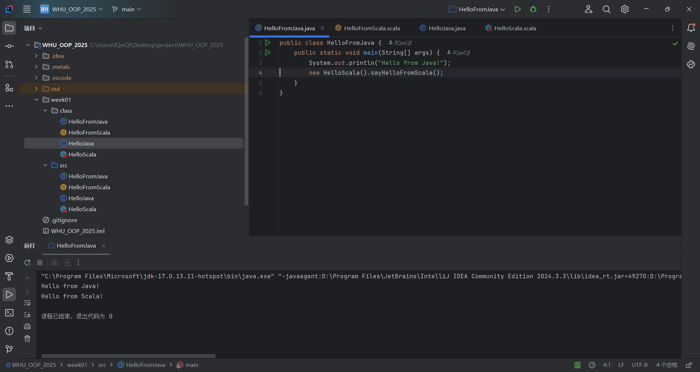
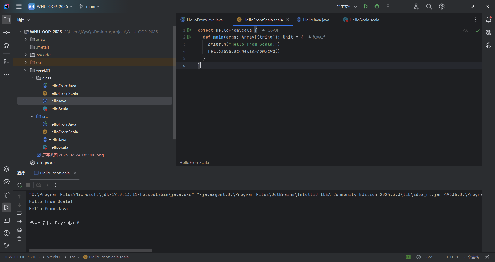

# 报告




## **1. 编译后字节码文件分析**

### **Java 类字节码**

1. **`HelloJava.class` 和 `HelloFromJava.class`**  
   - **反编译结果**：  
     - `HelloJava` 的静态方法直接对应 `public static sayHelloFromJava()`。  
     - `HelloFromJava` 的 `main` 方法直接调用 `HelloScala` 实例的 `sayHelloFromScala()`。  
   - **特点**：无额外修饰符或隐式逻辑，与源代码完全对应。另外，生成了默认构造函数。

### **Scala 类字节码**

1. **`HelloFromScala.class` 和 `HelloFromScala$.class`**  
   - **结构**：  
     - `HelloFromScala$` 是单例对象（`object`）的实际实现类，包含静态字段 `MODULE$` 保存单例实例。  
     - `HelloFromScala` 是代理类，其 `main` 方法委托给 `HelloFromScala$.MODULE$`。  

   - **特点**：Scala 的 `object` 通过生成单例类和代理类实现 JVM 兼容，Java 需通过 `HelloFromScala$.MODULE$` 访问单例方法。

## **2. Java 和 Scala 混合编程的实现方式**

### **互操作机制**

1. **Java 调用 Scala**  
   - **普通类**：Scala 类（非 `object`）编译为普通 JVM 类，Java 可直接通过 `new` 实例化并调用方法。  
   - **单例对象**：Scala 的 `object` 编译为单例类（`类名$`），Java 需通过 `类名$.MODULE$` 访问其实例。  

     ```java
     // Java 调用 Scala 单例对象方法
     HelloFromScala$.MODULE$.main(new String[0]);
     ```

2. **Scala 调用 Java**  
    Scala 可直接调用 Java 静态方法，语法与 Java 一致（如 `HelloJava.sayHelloFromJava()`）。  

### **JVM 层面的实现**

  Java 和 Scala 均编译为符合 JVM 规范的 `.class` 文件，JVM 仅识别字节码，不关心源代码语言。  

## **3. 观察现象分析**

### **1：Scala `object` 生成两个类**  

- **原因**：Scala 的 `object` 是语言层面的单例语法糖，需通过 `类名$` 实现单例模式，`类名` 作为代理类提供静态入口。  
- **JVM 表现**：  
  - `HelloFromScala$` 是实际单例类，`MODULE$` 是其实例。  
  - `HelloFromScala` 的 `main` 方法仅代理调用 `HelloFromScala$.MODULE$.main()`。  

### **2：入口方法的差异**  

- **Java 入口**：`public static void main(String[] args)` 是 JVM 标准入口方法。  
- **Scala 入口**：`object` 的 `main` 方法通过代理类适配为 JVM 入口。  

  ```java
    public final class HelloFromScala {
    public static void main(final String[] args) {
        .MODULE$.main(args);
    }
    }
  ```
