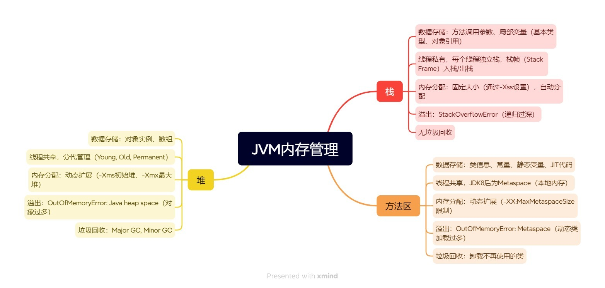
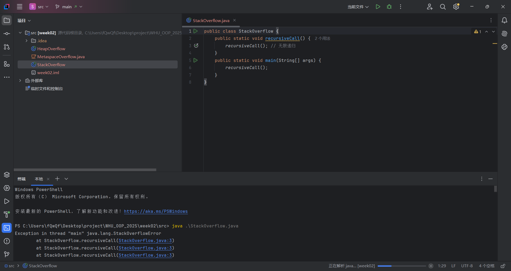
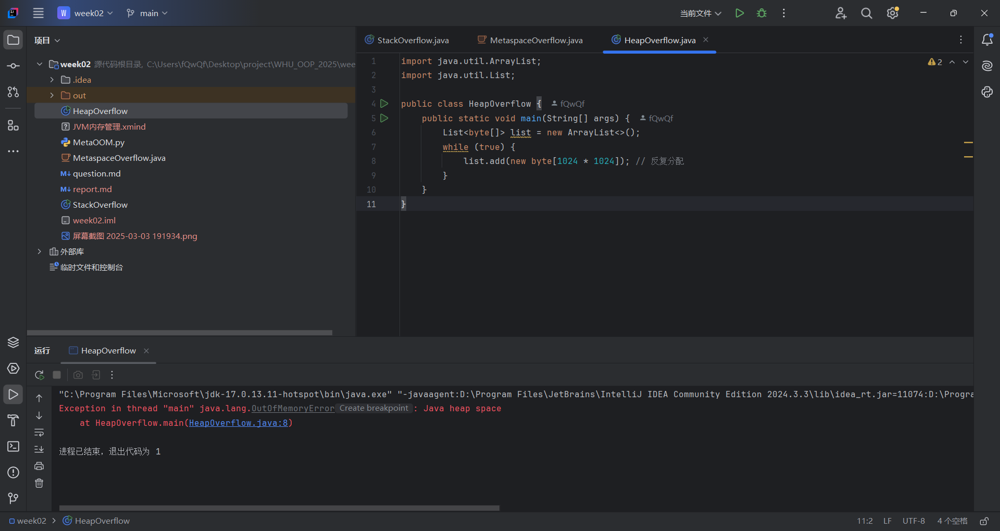
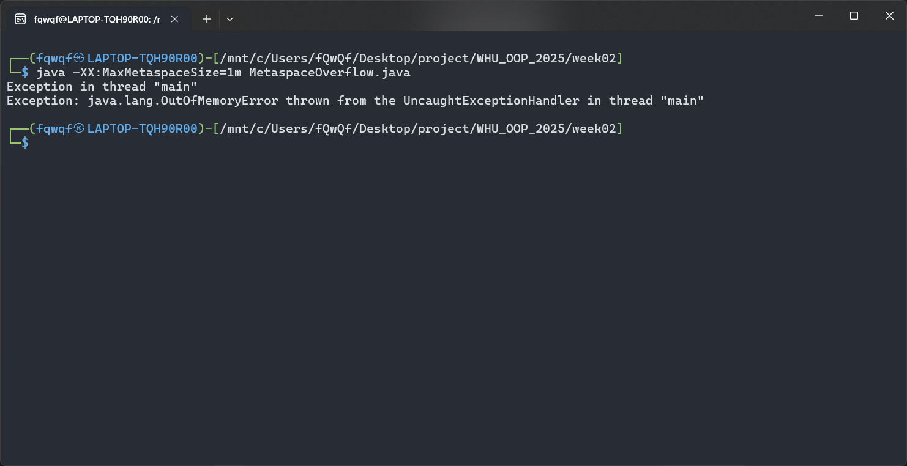

# week02

## 内存管理



交互关系：方法调用时栈帧入栈，对象在堆中创建，类信息在方法区存储。垃圾回收主要针对堆，方法区卸载类较少发生。

## 运行结果





值得一提的是，为了使得方法区溢出，我写了一个python脚本，用来生成类。脚本如下：

```python
num_classes = 50000

with open("MetaspaceOverflow.java", "w", encoding="utf-8") as f:
    f.write("public class MetaspaceOverflow {\n")
    f.write("    public static void main(String[] args) {\n")
    f.write(f"        for (int i = 0; i < {num_classes}; i++) {{\n")
    f.write("            try {\n")
    f.write("                Class.forName(\"Class_\" + i);\n")
    f.write("            } catch (ClassNotFoundException e) {\n")
    f.write("                e.printStackTrace();\n")
    f.write("            }\n")
    f.write("        }\n")
    f.write("    }\n")
    f.write("}\n\n")

    for i in range(num_classes):
        f.write(f"class Class_{i} {{\n")
        f.write("    private static Object obj = new Object();\n")
        f.write("    public static void method() {}\n")
        f.write("}\n\n")
```

除此之外，我使用了` -XX:MaxMetaspaceSize=1m `来限制方法区的大小，方便溢出。

另：希望可以交markdown文件。
