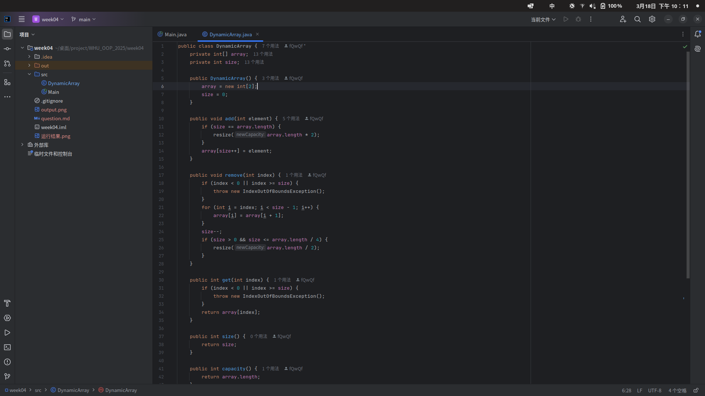
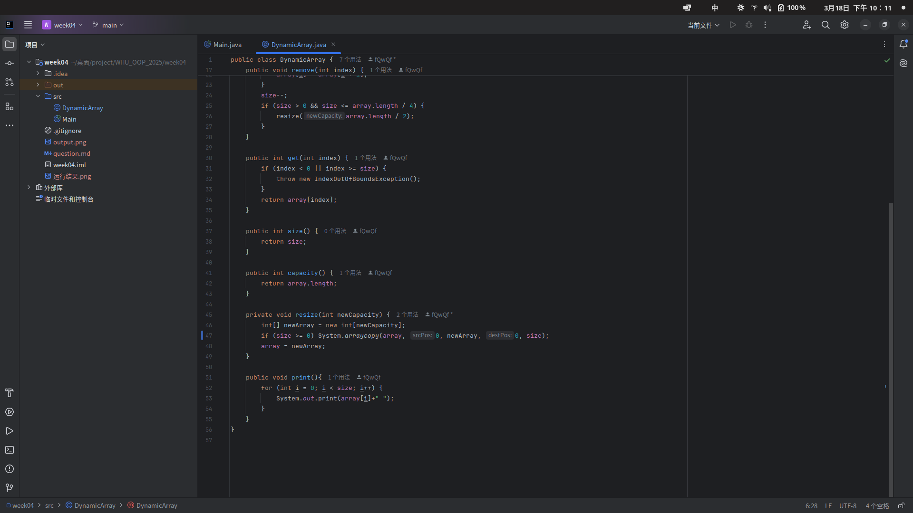
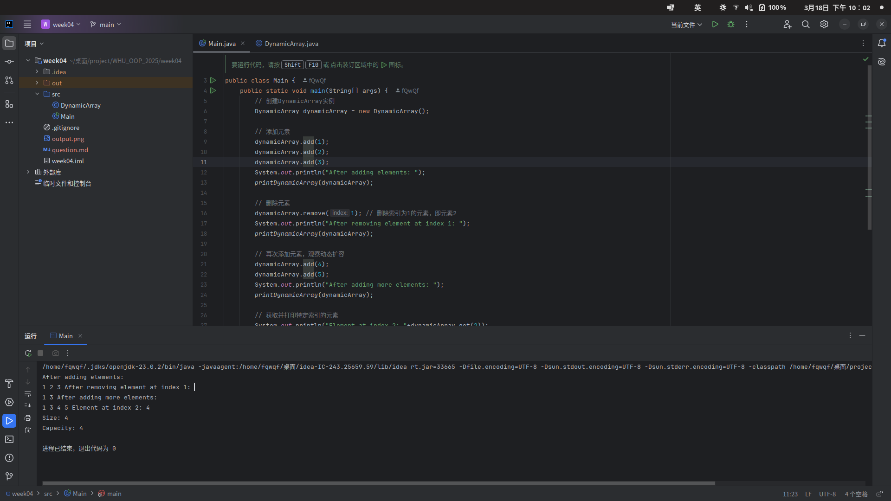

# 动态数组实现实验报告

## 一、实现思路

### 1. **整体设计**
动态数组的核心思想是**“按需扩容/缩容”**，即在添加或删除元素时，根据当前数组的使用情况自动调整容量。我设计的 `DynamicArray` 类包含以下关键部分：
- **底层数组**：用 `int[] array` 存储元素。
- **容量（capacity）**：数组的实际长度，初始为2。
- **大小（size）**：记录已存储的元素个数，初始为0。

### 2. **添加元素（add方法）**
- **步骤**：
  1. 检查当前数组是否已满（`size == array.length`）。
  2. 如果已满，调用 `resize` 方法将容量**翻倍**（例如从2扩容到4）。
  3. 将新元素放入数组末尾，`size` 加1。
- **举例**：初始容量为2，添加3个元素时，触发扩容到4；再添加第5个元素时，扩容到8。

### 3. **删除元素（remove方法）**
- **步骤**：
  1. 检查索引是否合法（`index < 0 || index >= size`），非法则抛出异常。
  2. 将删除位置后的元素**向前移动一位**，覆盖被删除元素。
  3. `size` 减1。
  4. 检查是否需要缩容：如果 `size <= 当前容量/4` 且 `size > 0`，则容量**减半**。
- **举例**：容量为4时删除元素，若 `size` 减到1（即 `1 <= 4/4`），则缩容到2。

### 4. **扩容/缩容（resize方法）**
- **核心逻辑**：
  1. 根据新容量创建新数组。
  2. 使用 `System.arraycopy` 将原数组元素复制到新数组。
  3. 将底层数组引用指向新数组。
- **注意点**：缩容条件设置为 `size <= capacity/4`（而非 `capacity/2`），是为了避免频繁扩容缩容导致的性能抖动。




## 二、关键代码说明

### 1. **添加元素时的扩容逻辑**
```java
public void add(int element) {
    if (size == array.length) {
        resize(array.length * 2); // 容量翻倍
    }
    array[size++] = element; // 放入元素并更新size
}
```
- **为什么翻倍？** 均摊时间复杂度为 O(1)，减少频繁扩容带来的开销。

### 2. **删除元素后的缩容判断**
```java
if (size > 0 && size <= array.length / 4) {
    resize(array.length / 2); // 容量减半
}
```
- **为什么是1/4？** 避免删除一个元素后立即触发缩容，比如容量4时删到3个元素，此时 `size=3 > 4/4=1`，不会缩容。

### 3. **数组复制与内存管理**
```java
private void resize(int newCapacity) {
    int[] newArray = new int[newCapacity];
    System.arraycopy(array, 0, newArray, 0, size); // 高效复制元素
    array = newArray; // 更新引用
}
```
- 其实`System.arraycopy`是IDEA推荐的😀 真智能啊
- **优点**：`System.arraycopy` 是本地方法，复制速度快。



## 三、测试结果分析

### 1. **测试流程与输出**
```java
public static void main(String[] args) {
    DynamicArray dynamicArray = new DynamicArray();
    
    dynamicArray.add(1);
    dynamicArray.add(2);
    dynamicArray.add(3);
    System.out.println("添加元素后：");
    printDynamicArray(dynamicArray); // 输出：1 2 3
    
    dynamicArray.remove(1);
    System.out.println("删除索引1后：");
    printDynamicArray(dynamicArray); // 输出：1 3
    
    dynamicArray.add(4);
    dynamicArray.add(5);
    System.out.println("再次添加元素后：");
    printDynamicArray(dynamicArray); // 输出：1 3 4 5
    
    System.out.println("索引2的元素：" + dynamicArray.get(2)); // 输出：4
    System.out.println("当前大小：" + dynamicArray.size());    // 输出：4
    System.out.println("当前容量：" + dynamicArray.capacity()); // 输出：8
}
```

### 2. **关键节点解释**
- **初始添加3个元素**：容量从2扩容到4，`size=3`。
- **删除索引1的元素**：`size=2`，容量仍为4（不满足缩容条件）。
- **再次添加4和5**：容量从4扩容到8，`size=4`。
- **最终结果**：容量为8，大小4，索引2的元素是4。

## 四、实验总结

通过这次实验，我深刻体会到数据结构设计中时间和空间的平衡的重要性，也意识到实际编码中细节处理（如边界条件）的关键性。动态数组虽然基础，但实现时需要考虑周全，这对编程能力提升很有帮助。
