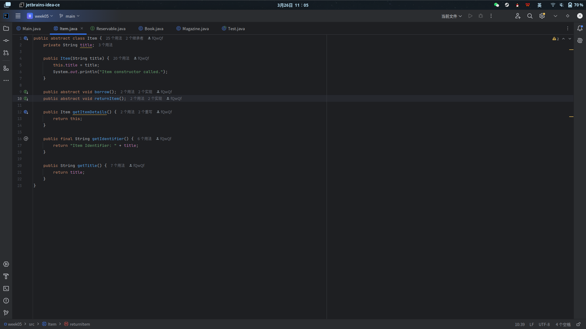
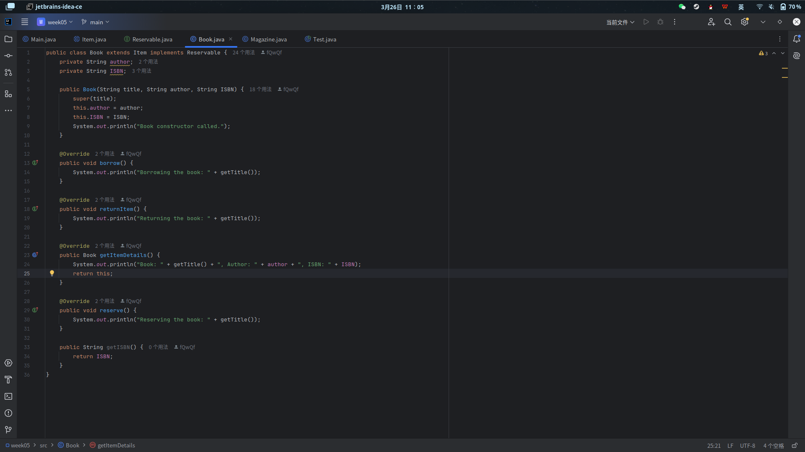
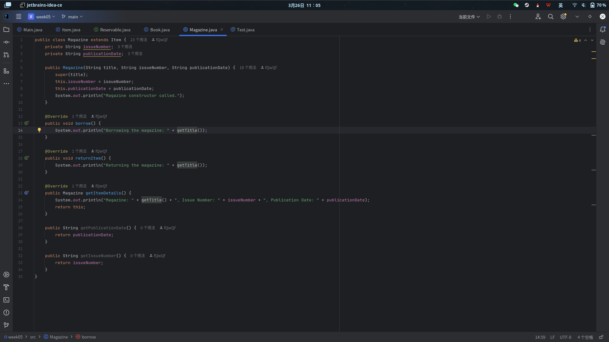
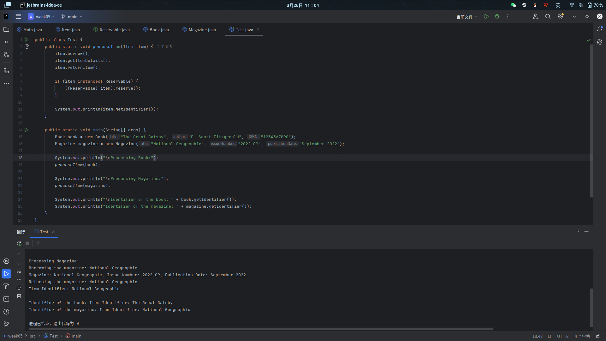

# week05报告

## **1. 概述**  

按要求完成 `Item`、`Book`、`Magazine` 类和 `Reservable` 接口，并且实现测试类。

## **2. 关键设计实现**  

### **2.1 抽象类 `Item`**  

- **设计目的**：作为所有图书馆物品的基类，定义公共属性和方法。  



### **2.2 接口 `Reservable`**  

- **设计目的**：定义可预约物品的通用行为。  


### **2.3 派生类 `Book` 和 `Magazine`**  

- **继承关系**：  

  ```text
  Item (父类)
  ├─ Book (子类，实现 Reservable)
  └─ Magazine (子类)
  ```  

- **构造函数调用顺序**：  
  - 创建子类对象时，父类 `Item` 的构造函数优先执行。  

- **协变返回类型**：  
  - `Book` 和 `Magazine` 重写 `getItemDetails()` 时返回具体类型：  
  - **优势**：调用者可以直接获取具体类型，无需强制类型转换。  




## **3. 多态与 Final 关键字**  

### **3.1 多态调用**  

- **方法 `processItem(Item item)`**：  

  ```java
  public static void processItem(Item item) {
      item.borrow();            // 多态调用子类的 borrow()
      item.getItemDetails();    // 多态调用子类的 getItemDetails()
      item.returnItem();        // 多态调用子类的 returnItem()

      if (item instanceof Reservable) {
          ((Reservable) item).reserve(); // 动态检查是否可预约
      }

      System.out.println(item.getIdentifier()); // 调用 final 方法
  }
  ```  

- **多态效果**：  
  - 通过父类引用 `Item item` 调用方法时，实际执行的是子类（`Book` 或 `Magazine`）的实现。  
  - 输出：  

    ```text
    Processing Book:
    Borrowing the book: The Great Gatsby       // Book 类的 borrow()
    Book: The Great Gatsby, Author: F. Scott... // Book 类的 getItemDetails()
    ```  

### **3.2 Final 关键字的作用**  

- **禁止重写**：  
  - `Item` 类的 `getIdentifier()` 标记为 `final`，子类无法覆盖。  
  - 若尝试在子类中重写，编译器会报错

## **4. 运行结果分析**  



### **4.1 构造函数调用顺序**  

- 创建 `Book` 对象时：  

  ```text
  Item constructor called.
  Book constructor called.
  ```  

- 创建 `Magazine` 对象时：  

  ```text
  Item constructor called.
  Magazine constructor called.
  ```  

- **结论**：父类构造函数优先于子类执行。  

### **4.2 多态与协变返回类型效果**  

- `Book` 的 `getItemDetails()` 返回 `Book` 类型，打印详细信息：  

  ```text
  Book: The Great Gatsby, Author: F. Scott Fitzgerald, ISBN: 1234567890
  ```  

- `Magazine` 的 `getItemDetails()` 返回 `Magazine` 类型，打印详细信息：  

  ```text
  Magazine: National Geographic, Issue Number: 2022-09, Publication Date: September 2022
  ```  

## **5. 总结**  

1. **面向对象特性**：  
   - 抽象类 `Item` 定义通用行为，子类通过继承实现差异化逻辑。  
   - 接口 `Reservable` 提供灵活的扩展机制。  
2. **多态与协变返回类型**：  
   - 多态调用简化了代码逻辑，提升可维护性。  
   - 协变返回类型增强类型安全性。  
3. **Final 关键字**：  
   - 确保关键方法（如 `getIdentifier()`）的稳定性，防止子类意外修改。  

**附：完整代码仓库**  

<https://github.com/fQwQf/WHU_OOP_2025/tree/main/week05>
