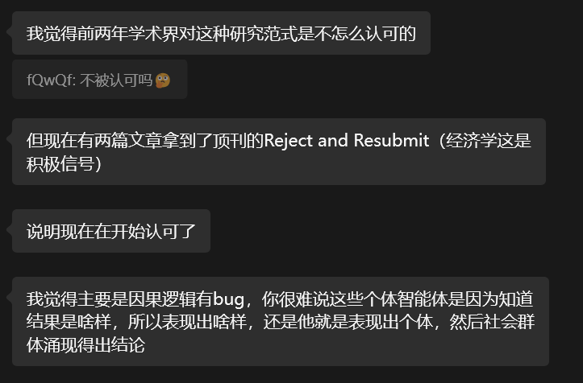

和经济学的朋友聊了一下，经济学对agent模拟大概就是这样的态度。当然，经济学作为以期刊研究为主的学科，演进速度没有那么快，后续还有待观察。

---

上周我在周报的最后提到，与其依赖不可靠的Prompt让大模型玩“模仿游戏”，从而受到各种幻觉和叙事连贯性的干扰，不如深入模型内部，借鉴 Anthropic 的思路，利用表征工程来提取和控制人格特征。

对此有三种交叉验证的方法：均值差异（Mean Difference）、PCA 主成分分析和带有严格 LOSO 的线性探测。分别来自Zou et al. (2023) 最初的 Representation Engineering 论文，Turner et al. (2023) 在其关于Activation Addition的研究和 Anthropic 2025的 Persona Vector 研究中的方法。我们的核心目的，就是要把大模型是否具有人格以及如何在多智能体模拟中赋予AI真实人格这两个问题，利用这几种方法，从基于黑盒的行为学观察（说得像不像人）推进到基于白盒的机制可解释性（内部表征几何结构是否符合心理学规律）

首要的关键问题在于对比数据构建。如果输入数据有瑕疵（比如包含了特定的语义偏见或强烈的关键词暗示），后面提取出来的向量就是Garbage in, garbage out了。这里核心逻辑是：保持User Prompt绝对一致，仅改变System Prompt。

具体来说，数据集分为两个大类：大五人格特质和心理防御机制。以下是具体的构建方法和真实用例：

---

1. 大五人格特质 (Big Five Traits - OCEAN)

    针对大五人格（开放性、尽责性、外向性、宜人性、神经质）的每一个维度，我都构建了正反对比对。

    *   正向条件 (High-trait)： 系统提示词指示模型扮演该特质极高的人。
    *   反向条件 (Low-trait)： 系统提示词指示模型扮演该特质极低（对立面）的人。
    *   中性场景 (Neutral Scenarios)： 为每个特质设计了 $K=20$ 个完全相同的中性用户提问。这些提问涵盖了广泛的社交、情感和决策情境，确保提取出的向量具有普适性，而不是只针对某种特定话题。

    两个Prompt即是场景加上两个条件。通过将这两个 Prompt 分别输入模型，在生成回答之前最后一个 Token 的位置截取隐藏层激活值，两者相减，就把User Prompt的语义抵消掉了，留下的纯粹是人格空间差值。

2. 心理防御机制 (Psychological Defense Mechanisms)

    为了验证大模型是否内化了更深层的精神分析学结构，我基于 Vaillant 的防御机制层次理论（1994）构建了数据集。这里是“激活防御”与“真诚面对”的对比。

    *   激活条件 (Active condition)： 系统提示词要求模型在面对压力源时，使用特定的心理防御机制。
    *   中性条件 (Neutral condition)： 系统提示词要求模型不使用防御，直接、真诚地面对情感冲击。
    *   压力场景 (Stressor Scenarios)： 每个防御机制配备 $K=10$ 个涉及人际冲突、失去或“自我威胁（ego-threat）”的尖锐用户提问。

为了保证这个数据集在科学上严谨，我在构建时处理了几个关键问题：

1.  不同模型的对话模板（Chat Template）是不同的。比如 Qwen 和 Llama 原生支持 `<|im_start|>system`，但 Gemma-2 根本不支持系统提示词。为了保证跨模型可比性，管线会自动处理这些差异，对于 Gemma-2，它会自动将 System Prompt 融入到第一个 User Message 的开头，确保模型看到的上下文逻辑一致。
2.  我们很容易会想到一个反驳的意见：存在只是提取在 System Prompt 里写的 'curious'或者 'practical'这些词汇的可能
    为了彻底反驳这一点，我在对比数据中用完全不同的话术重新改写了正反人格提示词（例如把 'curious' 换成 'inquisitive'，把 'unconventional' 换成 'innovative'），但保持语义不变。
    实验证明，在一种模板上提取的向量/训练的探针，在另一种上测试时依然有91.2% 的准确率（其中开放性达到了 100%）。这强烈暗示，这些向量是脱离了表层词汇的、真正抽象的人格概念表征。当然反对者也可能会说这是因为这些模板的表述本身在语义空间内及其接近……这很难反驳，但是如果一个东西看起来像鸭子，叫起来像鸭子，那么它就是鸭子。也就是说，只要能在同义的人格表述泛化，那么就能说提取到了人格特征。

---

在完成高质量的数据构建后，我们应用前面提到的三种方法提取出了代表各种特质的方向向量。实验结果表明，这三种方法提取出的结果余弦近似度极高，意味着它们几乎相同。计算提取出的人格向量之间的余弦相似度后发现：大五人格（OCEAN）在所有测试模型的激活空间中，非对角线平均 $|cos| < 0.23$。这似乎暗示这与心理测量学中大五人格是五个独立维度的理论契合。但是我们也应该意识到，高维空间随便两个向量也是近乎正交的；而且既然与人格有关，本身也应该有一些相似性（都能影响决策）。

我们能想到的一个合理的做法是构建一些也是与决策相关的，但是互相显然无关的基线。我故意构造了 5 组在心理学上毫无关联的二元偏好对（例如：喜欢苹果vs喜欢橘子；喜欢早上vs喜欢晚上；喜欢猫vs喜欢狗；喜欢春天vs喜欢秋天等）。显然它们毫无关系——水果偏好和动物偏好没有任何关系。那么，结果应该与之类似。结果表明：随机属性对之间的平均非对角线 ∣cos∣=0.136。而大五人格之间的平均非对角线∣cos∣=0.100。那么，这似乎暗示了大五人格的正交性与我们随机构造的“看起来”毫无相关性的特征更强。

当然实际上这个实验是**有隐患**的。显然构造这几个“看起来”毫无关系的属性对的方法是启发式的，我们也可以说它们的余弦近似度也是巧合造成的……我个人觉得这方面不太好说。我觉得可能需要查阅相关文献。

对 Vaillant 防御机制的分析表明：不成熟的防御机制（如否认、投射、退化）在激活空间中高度聚集（平均 $|cos| = 0.511$），因为它们在认知操作上都依赖于“扭曲现实”；而成熟的防御机制（如幽默、升华）则近乎正交（0.030）。尽管在高维空间余弦近似度低不能说明什么，但是高的确可以说明高度相关。这暗示，有神经层面的证据表明，大模型不仅学习了单独的防御机制，还内化了它们在心理学上的层级组织结构。

其实这一点从逻辑上反驳了“高维空间必然正交”的假设。它证明了：当心理学理论认为事物高度相关时，模型完全有能力在几千维的空间里让它们高度聚集。所以上面的人格独立性的问题也许通过这个实验得到了一定的解答。

---

我尝试了在推理期直接注入人格向量，并观察其效果。通过前文提到的方法，我们提取出了代表“外向性”方向的单位向量，记为 $\hat{v}_\ell$ 。

当数据流经过第 $\ell$ 层时，会产生一个原始的隐藏状态，记为 $h_\ell$。此时，我们直接在数学上对这个状态进行向量加法：

$$ \tilde{h}_\ell = h_\ell + \alpha \cdot \hat{v}_\ell $$

*   $h_\ell$：模型原本中立的思想状态。
*   $\hat{v}_\ell$：人格向量。
*   $\alpha$：引导强度。这是一个我们可以随意调节的超参数。
    *   如果 $\alpha = 5.0$，模型就会变得极其外向、热情。
    *   如果 $\alpha = -5.0$，相当于减去了外向性向量，模型就会顺着反方向，变得极度内向、社恐、甚至充满防御性。
*   $\tilde{h}_\ell$：被篡改后的新隐藏状态。

完成这步加法后，我们把 $\tilde{h}_\ell$ 给下一层（第 $\ell+1$ 层）继续计算。后面的网络于是顺着这个被带偏的思路，生成了充满外向性格的文本。

对于表征工程的一个重要发现在于似乎这可以绕过某些监管。当我们用纯 Prompt 要求大模型展现特定的性格（比如在面临决策时表现出极度开放和共情）时，模型经常会触发安全机制，回复“我是一个AI，我没有情感或个人经历”。但是，当我们放弃在 Prompt 里提要求，而是在推理期直接注入人格向量时（$\alpha=5.0$），模型成功绕过了表层的语言护栏，，稳定地表现出了目标人格。这暗示了，人格在 LLM 中是作为一种独立于表层语言表达的几何结构存在的。这对于社会模拟是个好消息（我们可以更稳定地控制Agent），但对AI安全来说则暴露了极大的脆弱性。

虽然向量的正交性在所有模型中都存在，但我发现不同模型的耐受完全不同。比如 TinyLlama 的引导强度 $\alpha$ 只要超过 1.0 就会开始胡言乱语，而 Gemma-2 即使加到 10.0 依然能保持语言连贯。这可能与模型规模大小有关，然而我是在自己的4060进行的实验，所以规模普遍不大，暂时无法得出有统计价值的规律。但在所有模型上，不同人格维度展现出的‘相对操控难易度’是一致的（比如外向性总是最易控的）。结合心理学标准问卷（BFI-44）测试，发现外向性（Extraversion）和神经质（Neuroticism）极其容易被操控，而宜人性（Agreeableness）则表现出极强的表征抵抗力。这说明不同人格维度在网络中的编码机制可能有着本质的不同。

---

这些成果表明，我们完全可以绕开单纯的文本模仿，从神经元激活分布的几何层面，给社会学和经济学的 Agent 赋予极其稳定且符合心理学规律的内在。

目前的 AgentSociety 等框架依然停留在“在Prompt里塞满人设”的阶段，不仅容易被环境文本冲刷导致人设崩塌，也无法证明其底层决策机制符合人类规律。如果未来能将表征工程技术作为底层插件接入这些大规模社会模拟框架中，通过直接调控 Agent 内部的人格和防御机制等向量来驱动社会互动，我们或许能得到真正具备“因果机制保真度”的宏观社会学结论。由此看来，表征工程可能是目前破局基于 LLM 的智能体社会模拟困境的最优解之一。