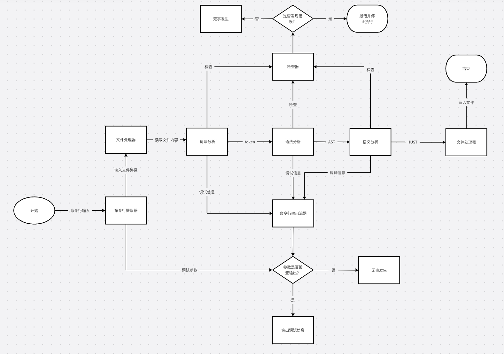
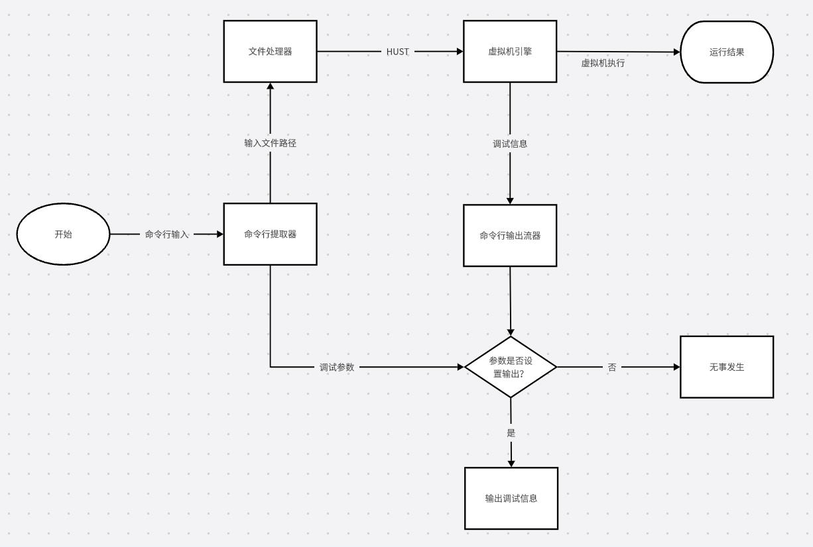
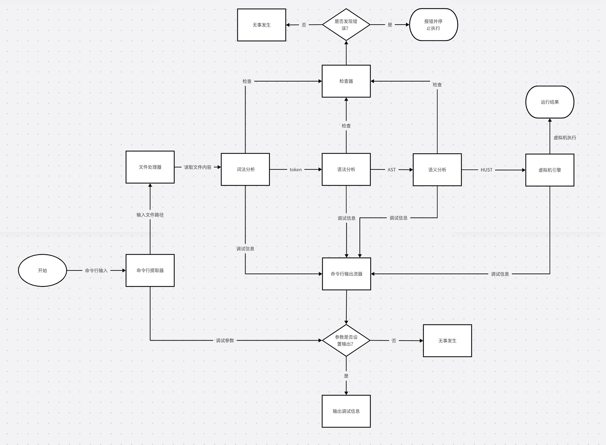
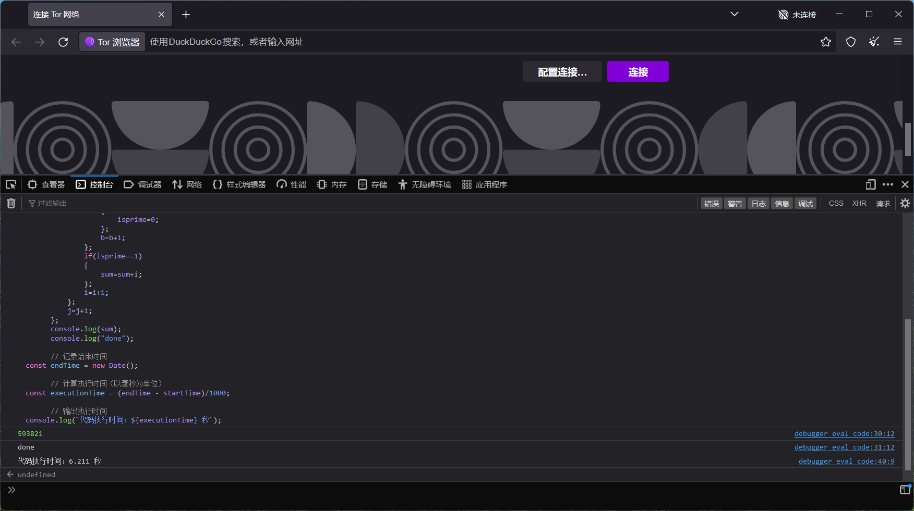
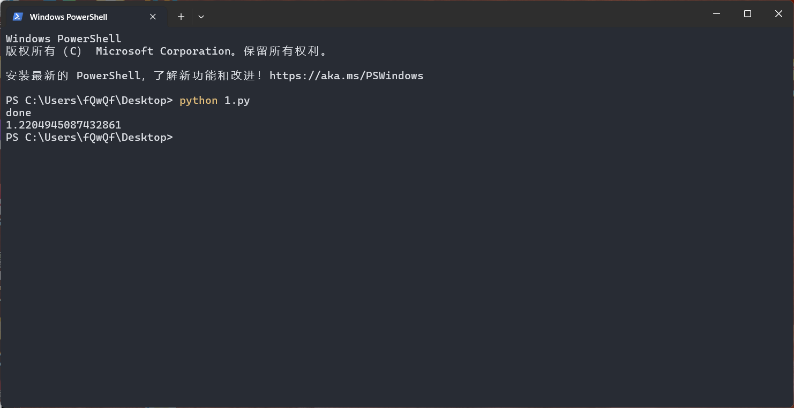
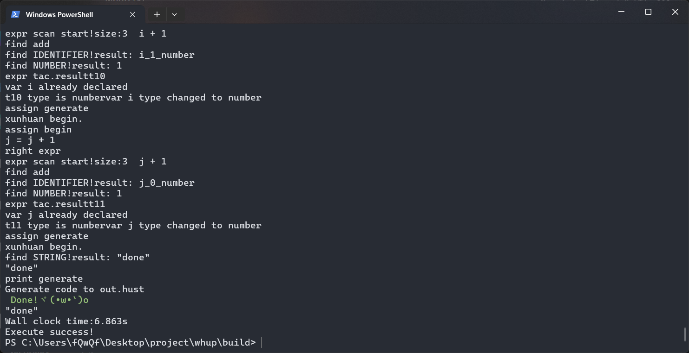
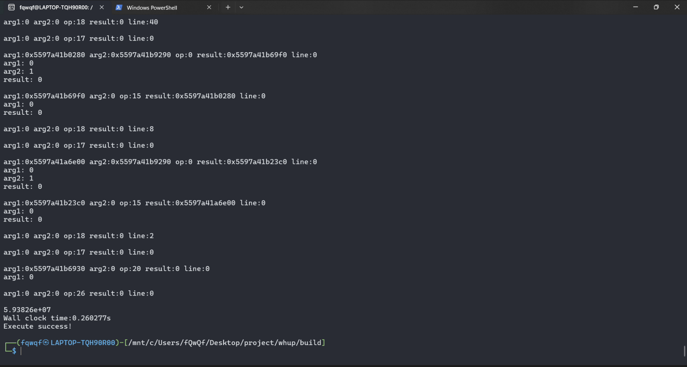

# WHUP软件系统设计

## 1.软件概述


WHUP（High-level Unified Programming）是一个综合性编程工具链项目，主要包括两种编程语言（WHU和HUST），以及一套相应的编译器、虚拟机和运行环境。该项目的核心目标是提供一个简洁、高效的编程平台，支持从高级编程语言到低级语言的编译和执行。WHUP的设计注重模块化和可扩展性，使开发者能够在一个统一的环境中进行开发、调试和优化。  

项目源码地址：<https://github.com/fQwQf/whup>

WHUP各组件分别可实现以下功能：

1. **WHU编程语言**  
   一种强类型、静态类型的高级编程语言，具有先编译后执行的特性。WHU的设计旨在提供简洁而强大的语法，适合高效开发。

2. **HUST编程语言**  
   一种低级编程语言，专为WHUPVM虚拟机设计，直接运行在虚拟机上。HUST语言的执行效率高，适合用作虚拟机中的中间代码。

3. **WHUPC编译器**  
   将WHU高级语言代码编译成低级语言HUST。WHUPC负责将WHU代码转化为能够在虚拟机中执行的HUST代码。

4. **WHUPVM虚拟机**  
   一个无寄存器的虚拟机，能够直接运行HUST代码，并模拟堆内存访问。虚拟机设计简洁，支持直接执行低级语言，提高运行效率。

5. **WHUPRUN环境**  
   结合WHUPC编译器和WHUPVM虚拟机，提供一个完整的执行环境，能够直接运行WHU代码，简化开发流程。

## 2.软件组成

### 1.模块

#### 命令行提取器

命令行提取器从命令行中提取出源代码文件名和目标文件名。

#### 词法分析器

词法分析器进行词法分析，将源代码分解成一个个token（词法单元，包含类型、值和所在行数以及文件名）。然后将token交给语法分析器。

#### 语法分析器

语法分析器进行语法分析，将token组合成抽象语法树。然后将抽象语法树交给语义分析器。

#### 语义分析器

语义分析器进行语义分析，检查语法树是否合法。然后根据语法树生成HUST。

#### 文件处理器

文件处理器从源代码文件夹中读取源代码，以源代码的源格式交给词法分析器。文件处理器也将HUST代码写入目标文件中，并从文件中读取HUST代码，将其交给虚拟机执行。

#### 代码检查器

代码检查器同时对词法分析器、语法分析器、语义分析器、代码生成器相联系，在每次进行处理时检查每一步文件数据和操作是否合法。

#### 命令行调试输出流器

命令行调试输出流器根据命令行参数，判断是否需要输出调试信息。

#### 虚拟机引擎

虚拟机引擎对HUST进行二次编译，转化为二级指针和操作符形式的三地址码，然后执行，输出结果。

### 2.工具包含的模块

1. **WHUPC编译器**  
   包括命令行提取器，词法分析器，语法分析器，语义分析器，文件处理器，代码检查器，命令行调试输出流器。

2. **WHUPVM虚拟机**  
   包括命令行提取器，文件处理器，命令行调试输出流器。

3. **WHUPRUN环境**  
   包括命令行提取器，词法分析器，语法分析器，语义分析器，文件处理器，代码检查器，命令行调试输出流器，虚拟机引擎。

## 3.软件流程设计

WHUPC编译器的工作流程如下：



1. **命令行接口输入**：
   - 用户输入命令，包括代码文件路径和调试参数。  
   - 命令行接口将输入数据传递给**命令行提取器**。

2. **文件处理器**：
   - 处理命令中的文件路径，读取文件内容。  
   - 将文件内容传递给**词法分析器**。

3. **词法分析器**：
   - 对文件内容进行词法分析，生成词法单元（Token）。  
   - 将 Token 输出到**语法分析器**。

4. **语法分析器**：
   - 接收 Token 并进行递归下降分析，生成**抽象语法树（AST）**。  
   - 同时生成调试信息，将 AST 输出到**语义分析器**。

5. **语义分析器**：
   - 检查 AST 中的语义错误，如变量未定义、类型不匹配等。  
   - 如果无错误，将 AST 转换成中间代码（HUST）。  
   - 输出 HUST 代码给**文件处理器**。

6. **检查器**：
   - 在各阶段对代码进行检查，确保代码正确无误。  
   - 若发现错误，则报告错误并停止执行。

7. **调试信息输出（可选）**：
   - **命令行输出器**判断是否有调试参数。  
     - 若有调试参数，则输出调试信息。  
     - 若无调试参数，则继续流程。

8. **文件处理器**：
   - 将 HUST 代码写入文件，作为最终编译结果。  
   - 编译流程结束。

WHUPVM虚拟机的工作流程如下：



1. **命令输入**：
   - 用户通过命令行输入文件路径和调试参数。
   - **命令行提取器**提取文件路径和调试参数。

2. **文件处理**：
   - **文件处理器**接收输入的文件路径，读取文件内容，生成中间代码（HUST）。

3. **虚拟机执行**：
   - **虚拟机引擎**接收中间代码（HUST）并执行代码逻辑。
   - 运行结果通过虚拟机引擎输出。

4. **调试参数判断**：
   - **命令行输出流器**接收调试参数，判断是否需要输出调试信息。
     - **如果未设置**调试输出参数：  
       - 直接结束流程，无异常发生。
     - **如果设置了**调试输出参数：  
       - 输出调试信息（调试过程或代码执行中的信息）。

5. **最终结果输出**：
   - 执行结果由虚拟机引擎生成，用户可以查看运行结果。

WHUPRUN环境的工作流程如下：



1. **命令输入**：
   - 用户通过命令行输入文件路径和调试参数。
   - 输入传递给**命令行提取器**进行解析。

2. **文件读取**：
   - **文件处理器**根据输入的文件路径，读取文件内容。
   - 将文件内容传递给**词法分析器**。

3. **词法分析**：
   - **词法分析器**将代码转换为词法单元（Token）。
   - Token 数据传递给**语法分析器**。

4. **语法分析**：
   - **语法分析器**通过解析 Token，生成**抽象语法树（AST）**。
   - 同时生成调试信息，并将 AST 传递给**语义分析器**。

5. **语义分析**：
   - **语义分析器**检查代码的语义是否正确，例如变量类型匹配、逻辑是否合理等。
   - 生成中间代码（HUST），并传递给**虚拟机引擎**。

6. **检查器检查**：
   - **检查器**对前述分析阶段进行检查，确保没有错误。
   - 如果出现错误，则停止执行并报告错误。  
   - 如果没有错误，流程继续。

7. **调试信息输出**（可选）：
   - **命令行输出器**判断是否设置了调试参数。
   - 如果用户设置了调试参数，则输出调试信息；否则跳过。

8. **虚拟机执行**：
   - **虚拟机引擎**接收中间代码（HUST），执行代码逻辑。
   - 生成最终的运行结果。

9. **结果输出**：
   - 虚拟机执行的结果输出给用户。

## 4.核心算法

### 简介

我们在编译器的语法分析阶段使用了递归下降算法，通过递归调用函数来处理语法结构，生成抽象语法树和三地址代码。实现包括以下几个方面：

1.为每个语法规则编写相应的递归函数。

2.使用词法分析器将源代码分解成词法单元。

3.通过递归调用函数解析语法结构。

4.在解析过程中检测语法错误并提供错误信息。

5.生成抽象语法树和三地址代码。

这种方法结构清晰，易于理解和维护，适用于处理简单的语法规则。

我们为语句块设计了Block类
Block能够按分号分隔语句并逐句处理
所有语句都在一个全局Block内
抽象语法树中Block的子节点的个数由whup源代码决定

```cpp
//这里给出了部分子节点的处理方式，主要是对关键字的处理
void Block::generate(std::vector<Token> subtokens)
{
     if (subtokens[0].type == KEYWORD && subtokens[0].value == "var")
    {
        new Var(subtokens,env);
        WHUPout << "var generate" << std::endl;
    }
    else if(subtokens[0].type == KEYWORD && subtokens[0].value == "number")
    {
        WHUPout << "find number" << std::endl;
        new Arr(subtokens,env,"number");
        WHUPout << "arr generate" << std::endl;
    }
    else if(subtokens[0].type == KEYWORD && subtokens[0].value == "string")
    {
        new Arr(subtokens,env,"string");
        WHUPout << "arr generate" << std::endl;
    }
    else if (subtokens[0].type == KEYWORD && subtokens[0].value == "print")
    {
        new Print(subtokens,env);
        WHUPout << "print generate" << std::endl;
    }
    else if(subtokens[0].type==KEYWORD && subtokens[0].value=="if")
    {
        new If(subtokens,env);
    }
    else if(subtokens[0].type==KEYWORD && subtokens[0].value=="while")
    {
        new While(subtokens,env);
    }
    else if(subtokens[0].type==KEYWORD && subtokens[0].value=="break")
    {
        new Break(env);
    }
    else if(subtokens[0].type==KEYWORD&&subtokens[0].value=="continue")
    {
        new Continue(env);
    }
    else if(subtokens[0].type==KEYWORD&&subtokens[0].value=="return")
    {
        if (function_ret_label == "")
        {
            pushErrors(subtokens[0],"unexpected retrun");
        }
        else
        {
            if (subtokens.size() == 1)
            {
                new Return(env);
                WHUPout << "find return!" << std::endl;
            }
            else
            {
                new Return(subtokens, env);
                WHUPout << "find return!" << std::endl;
            }
        }
    }
    else if(subtokens[0].type==KEYWORD&&subtokens[0].value=="function")
    {
        new Function(subtokens,env);
    }
    else if(subtokens[0].type==KEYWORD&&subtokens[0].value=="class")
    {
        new Class(subtokens);
    }
}
```

在Block的成员函数generator中我们对单个语句进行判断，调用相应的构造函数
而在各种语法规则的构造函数中，由于存在Block的嵌套，又会递归地调用Block的构造对象

以While循环类为例：
```cpp
class While
{
    //抽象语法树中，一个While结点有一个Expr子节点和一个Block子节点
	Expr* While_Expr;
	Block* While_Block;

	Environment* While_env;
public:
	While(std::vector<Token> &code, Environment* env);
	void matchPar(int& pos, std::vector<Token>code);
	void matchBrace(int& pos, std::vector<Token>code);
};


While::While(std::vector<Token> &code,Environment*env):While_env(env)
{
    //此处省略语句处理
    While_Expr = new Expr(std::vector<Token>(code.begin(), code.begin() + pos+1),this->While_env);
    //此处省略语句处理、跳转实现等操作
    While_Block = new Block(std::vector<Token>(code.begin() + Block_begin + 1, code.begin() + pos+1), While_env);
}
```

### 时间复杂度 

递归下降解析器的时间复杂度主要取决于输入的长度和解析过程中递归调用的深度。对于每个语法规则，解析器会扫描输入的每个词法单元（Token），并根据语法规则进行递归调用。

1.单个语法规则的时间复杂度：
    对于每个语法规则，解析器会扫描输入的每个词法单元，时间复杂度为 O(n)，其中 n 是输入的长度。

2.整体时间复杂度：
    由于递归下降解析器是自顶向下解析的，每个语法规则的解析时间是线性的，因此整体时间复杂度为 O(n)，其中 n 是输入的长度。

### 空间复杂度

递归下降解析器的空间复杂度主要取决于递归调用的深度和解析过程中使用的数据结构。

1.递归调用的深度：
递归调用的深度取决于语法规则的嵌套层次。对于大多数编程语言，语法规则的嵌套层次是有限的，因此递归调用的深度是常数级别的。
例如，在解析嵌套的括号或大括号时，递归调用的深度取决于括号或大括号的嵌套层次。

2.使用的数据结构：
解析器在解析过程中会使用一些数据结构来存储词法单元、抽象语法树和三地址代码等。
这些数据结构的空间复杂度通常是线性的，即 O(n)，其中 n 是输入的长度。

### 代码分析

```cpp
void Block::block(std::vector<Token> tokens) {
    for (int i = 0; i < tokens.size(); ++i) {
        if (tokens[i].type == IDENTIFIER) {
            // 根据首token传入对应的类的构造函数中
            if (tokens[i].value == "if") {
                If ifStatement(tokens, env);
            } else if (tokens[i].value == "while") {
                While whileStatement(tokens, env);
            } else if (tokens[i].value == "return") {
                Return returnStatement(tokens, env);
            }
            // 其他语句类型的处理...
        }
    }
}
```

时间复杂度：block 函数会遍历所有的词法单元，并根据首个词法单元调用相应的类的构造函数来处
理不同的语句类型。因此，时间复杂度为 O(n)，其中 n 是输入的长度。

空间复杂度：block 函数使用了线性级别的空间来存储词法单元，因此空间复杂度为 O(n)。

## 5.软件界面设计

### **设计概述**  
WHUP工具系列（`whuprun`、`whupvm`、`whupc`）的用户界面为**命令行用户界面（CLI）**，主要通过文本命令与用户交互，提供参数化控制与文件输入输出功能。用户通过键盘输入命令并指定参数，程序执行后返回结果或调试信息。

---


### **命令行工具设计**
每个工具 (`whuprun`、`whupvm`、`whupc`) 提供特定功能，界面元素包括以下几个部分：  

**a. `whuprun` 命令行界面**  
   - **命令**：`whuprun`  
   - **参数说明**：
     | 参数                 | 说明                             |
     |----------------------|----------------------------------|
     | `<file>`             | 输入文件路径                     |
     | `-i / --input`       | 指定输入文件路径                 |
     | `-c / --clock`       | 输出程序运行的总时间             |
     | `-pc1 / --print-c1`  | 输出第一阶段编译的详细信息       |
     | `-pc2 / --print-c2`  | 输出第二阶段编译的详细信息       |
     | `-pe / --print-e`    | 输出程序执行的详细信息           |

   - **示例界面交互**：
     ```Powershell
     ┌──(user㉿hostname)-[/mnt/c/project/whup/build]
     └─$ whuprun -i input.whup -c --print-c1 --print-e
     First Compilation Details: ...
     Execution Details: ...
     Wall Clock Time: 0.543s
     ```

---

**b. `whupvm` 命令行界面**  
   - **命令**：`whupvm`  
   - **参数说明**：
     | 参数                 | 说明                             |
     |----------------------|----------------------------------|
     | `<file>`             | 输入文件路径                     |
     | `-i / --input`       | 指定输入文件路径                 |
     | `-c / --clock`       | 输出虚拟机运行的总时间           |
     | `-pc2 / --print-c2`  | 输出第二阶段编译的详细信息       |
     | `-pe / --print-e`    | 输出虚拟机执行的详细信息         |

   - **示例界面交互**：
     ```Powershell
     ┌──(user㉿hostname)-[/mnt/c/project/whup/build]
     └─$ whupvm -i out.hust --clock --print-c2
     Wall Clock Time: 0.321s
     Second Compilation Details: ...
     ```

---

**c. `whupc` 命令行界面**  
   - **命令**：`whupc`  
   - **参数说明**：
     | 参数                 | 说明                             |
     |----------------------|----------------------------------|
     | `<file>`             | 输入文件路径                     |
     | `-i / --input`       | 指定输入文件路径                 |
     | `-o / --output`      | 指定输出文件路径 (默认: out.hust)|
     | `-pc1 / --print-c1`  | 输出第一阶段编译的详细信息       |

   - **示例界面交互**：
     ```Powershell
     ┌──(user㉿hostname)-[/mnt/c/project/whup/build]
     └─$ whupc input.whup -o my_output.hust --print-c1
     First Compilation Details: ...
     Generate code to my_output.hust
     Done!ヾ(•ω•`)o
     ```

---

### **界面交互总结**

1. **清晰的输入格式提示**：  
   每个工具通过 `Usage` 提示命令格式，用户可以快速了解如何使用命令和参数。  

2. **参数化设计**：  
   提供了灵活的选项，包括文件路径输入、输出调试信息、执行时间统计等功能，用户可以根据需求进行组合。  

3. **结果输出与反馈**：  
   - **正常执行**：显示运行结果、文件输出路径或调试信息。  
   - **错误处理**：若参数缺失或文件路径错误，界面将输出错误信息提示用户。  

4. **统一的界面风格**：  
   三个工具的设计风格保持一致，参数命名规则和命令格式统一，降低了用户学习成本。  

---

### **总结**

WHUP 系列工具的命令行用户界面设计，结构简单、功能清晰，充分利用参数化选项实现功能扩展。CLI 设计保持一致风格，满足高级用户对程序执行、编译调试与时间统计的需求。

## 6.小结

在最初，WHUP性能并不占优，仅拿 `/docs/example/prime.whup` 为例，WHUP运行时间约为90s，而对于相同的算法，Python运行时间约为1.2s，tor Javascript解释器运行时间约为6.2s。





通过减少字符串操作的次数，WHUP实现了一定的性能优化，运行时间缩短到了6.86秒。然而，WHUP的性能仍与主流编程语言存在明显差距，因此，我们决定对WHUP进行进一步优化。



最后，我们重写了虚拟机引擎，引入了二次编译，对于该测试用例将WHUP的运行效率提升了惊人的347倍，且达到了Python运行效率的4.69倍。



项目实现了预期目标，达到了卓越的性能提升。而WHUP的卓越性能来自对极致的不屑追求。就whupvm来说，光是大的重构就有整整两次，小的调整更是不计其数。这充分展现了团队的进取精神和高效的协作能力。

尽管效果已十分优秀，仍有进一步优化的空间。例如：

1. **算法优化**：进一步精简核心逻辑，提高执行效率。  
2. **内存管理**：通过更精准的资源分配，减少内存占用，提升运行稳定性。  
3. **面向对象支持**：当前面向对象仅支持封装，未支持继承和多态，未来可考虑支持。  
4. **工具链优化**：完善开发工具链，提升项目维护性和易用性。  

总体而言，本项目的成果令人瞩目，为后续优化和扩展奠定了坚实的基础。
